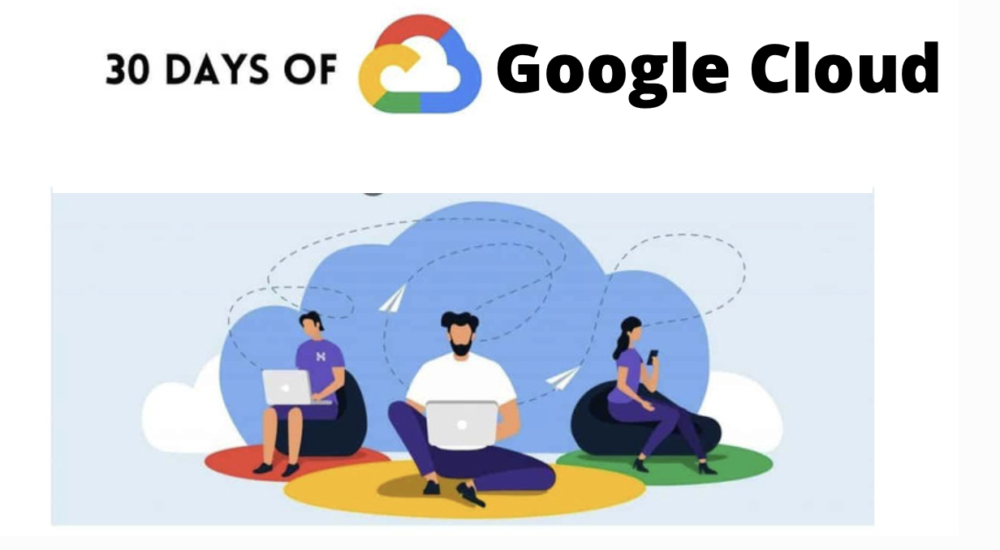
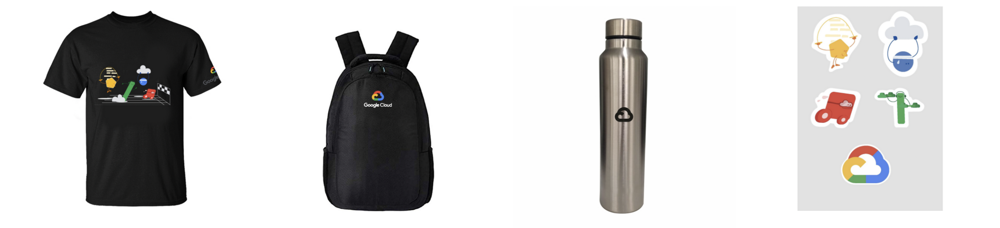

<h1 align="center"> 30-Days-of-GCP ☁️</h1>

 
<h2 align="center">About 👀</h2>
   
Google Cloud in collaboration with Developer Students Club (DSC) provides an opportunity to students to start their journey in cloud programming with hands-on labs on Google Cloud Platform that powers apps like Google Search, Gmail, and YouTube.
30 Days of Google Cloud program will introduce you to concepts such as Computing, Application Development, Big Data & Machine Learning using Google Cloud’s training platform ‘Qwiklabs’ where you will learn each of these topics using self-paced labs.

More about GCP can be read at - [Click here](https://cloud.google.com/gcp)

There will be two tracks :

<h3 align="center">Track 1: Cloud Engineering Track</h3>

1)[Getting Started: Create and Manage Cloud Resources](https://google.qwiklabs.com/quests/120?utm_source=google&utm_medium=lp&utm_campaign=gcpskills) 
 
2)[Perform Foundational Infrastructure Tasks in Google Cloud](https://google.qwiklabs.com/quests/118?utm_source=google&utm_medium=lp&utm_campaign=gcpskills)
 
3)[Setup and Configure a Cloud Environment in Google Cloud](https://google.qwiklabs.com/quests/119?utm_source=google&utm_medium=lp&utm_campaign=gcpskills)
 
4)[Deploy and Manage Cloud Environments with Google Cloud](https://google.qwiklabs.com/quests/121?utm_source=google&utm_medium=lp&utm_campaign=gcpskills)
 
5)[Build and Secure Networks in Google Cloud](https://google.qwiklabs.com/quests/128?utm_source=google&utm_medium=lp&utm_campaign=gcpskills)
 
6)[Deploy to Kubernetes in Google Cloud](https://google.qwiklabs.com/quests/116?utm_source=google&utm_medium=lp&utm_campaign=gcpskills)

<h3 align="center">Track 2: Data Science & Machine Learning Track</h3>

1)[Getting Started: Create and Manage Cloud Resources](https://google.qwiklabs.com/quests/120?utm_source=google&utm_medium=lp&utm_campaign=gcpskills)
 
2)[Perform Foundational Data, ML, and AI Tasks in Google Cloud](https://google.qwiklabs.com/quests/117?utm_source=google&utm_medium=lp&utm_campaign=gcpskills)
 
3)[Insights from Data with BigQuery](https://google.qwiklabs.com/quests/123?utm_source=google&utm_medium=lp&utm_campaign=gcpskills)
 
4)[Engineer Data in Google Cloud](https://google.qwiklabs.com/quests/132?utm_source=google&utm_medium=lp&utm_campaign=gcpskills)
 
5)[Integrate with Machine Learning APIs](https://google.qwiklabs.com/quests/136?utm_source=google&utm_medium=lp&utm_campaign=gcpskills)
 
6)[Explore Machine Learning Models with Explainable AI](https://google.qwiklabs.com/quests/126?utm_source=google&utm_medium=lp&utm_campaign=gcpskills)
 
 

# Rewards🥇
- For beginners this is the great opportunity to deep-dive into the Google cloud and learn about it.
- Laptop stickers
- Google Cloud T-shirt👕
- Laptop bag
- Water bottle

 

## For Quick start guide and FAQ : [Click here](CONTRIBUTING.md) 

 

show some ❤️&nbsp; by giving a star to this repo!!

